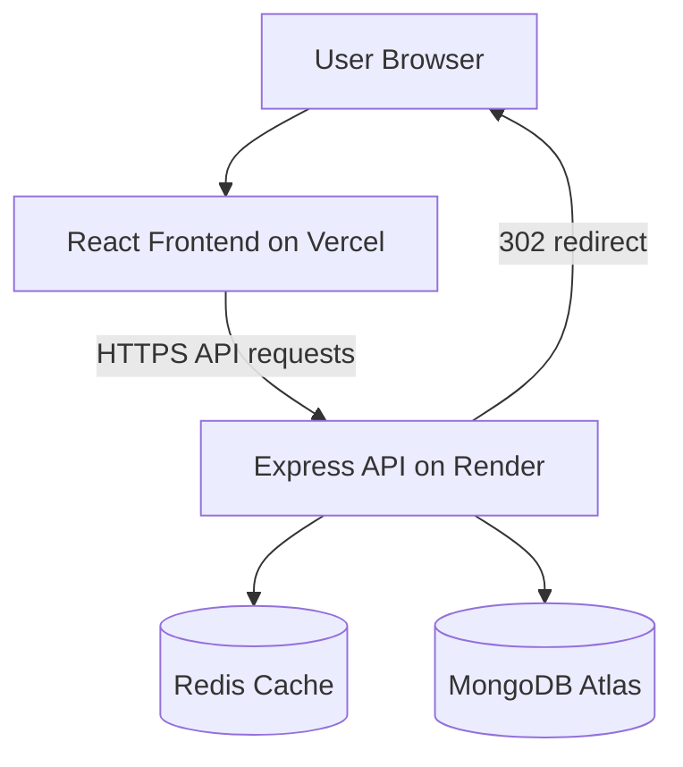
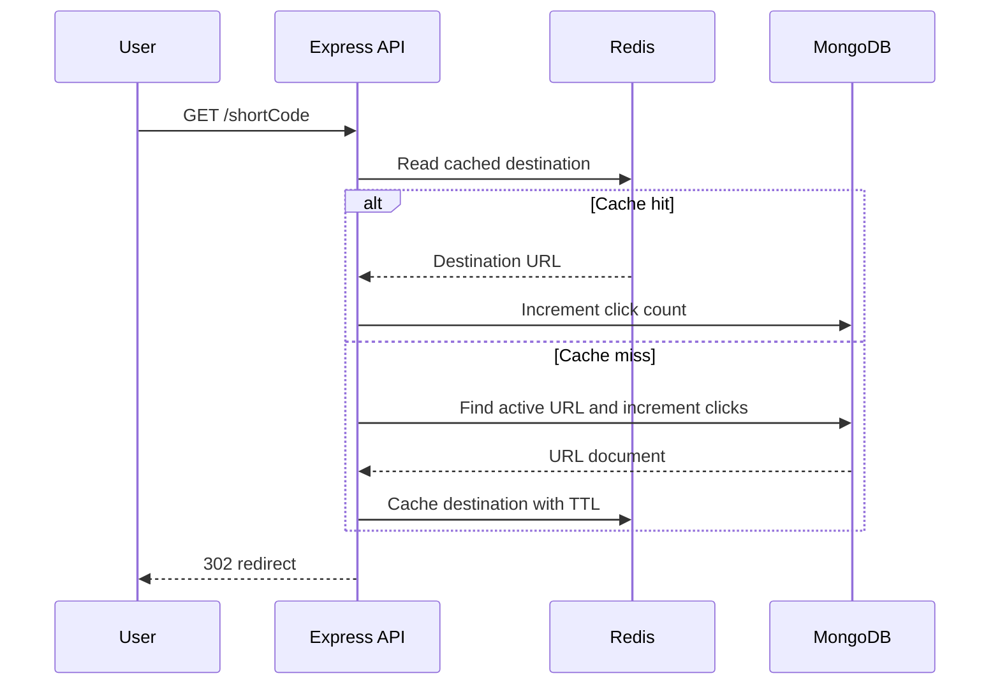

# LinkScale

A production-ready MERN URL shortener built with authentication, Redis caching, click analytics, rate limiting and user-level link ownership.

## Live Application

- Frontend: https://link-scale-eta.vercel.app
- Backend health: https://linkscale-api.onrender.com/api/v1/health
- GitHub: https://github.com/aloksingh003/LinkScale

## Features

- User registration, login and logout
- JWT authentication using HTTP-only cookies
- Protected dashboard and API routes
- Automatic Base62 short-code generation
- Custom URL aliases
- Optional link expiration
- Click-count tracking
- Link activation and deactivation
- User-level URL ownership
- Pagination
- Redis cache-aside strategy
- Cache invalidation after link updates
- API and authentication rate limiting
- Persistent light and dark themes
- Responsive React interface
- Automated backend tests
- Production deployment using Vercel and Render

## Technology Stack

| Layer            | Technology                       |
| ---------------- | -------------------------------- |
| Frontend         | React, Vite, React Router, Axios |
| Backend          | Node.js, Express                 |
| Database         | MongoDB Atlas, Mongoose          |
| Cache            | Redis Cloud                      |
| Authentication   | JWT, HTTP-only cookies, bcryptjs |
| Security         | Helmet, CORS, rate limiting      |
| Testing          | Node test runner, Supertest      |
| Frontend hosting | Vercel                           |
| Backend hosting  | Render                           |

## System Architecture



### Main request flow

1. The React frontend sends API requests to the Express backend.
2. Express validates the request and authenticates the user.
3. MongoDB stores users, URLs, ownership and analytics.
4. Redis caches frequently accessed redirect information.
5. The public short-link endpoint returns a temporary `302` redirect.
6. Click counters are updated atomically in MongoDB.
7. Browser caching is disabled for redirects so click tracking remains accurate.

## Redirect Flow



## Important System-Design Decisions

| Decision                   | Reason                                                   |
| -------------------------- | -------------------------------------------------------- |
| Base62 short codes         | Compact codes with a very large number of combinations   |
| Unique database index      | Prevents duplicate aliases and generated codes           |
| Retry-based generation     | Handles rare short-code collisions safely                |
| Redis cache-aside pattern  | Reduces repeated MongoDB reads                           |
| MongoDB as source of truth | Cached information can always be rebuilt                 |
| Cache invalidation         | Prevents outdated links after updates                    |
| Atomic click increment     | Avoids lost updates during concurrent requests           |
| Soft deactivation          | Preserves analytics instead of deleting data             |
| User ownership filters     | Prevents users from accessing another user's links       |
| HTTP-only cookie           | JavaScript cannot directly read the authentication token |
| Rate limiting              | Reduces brute-force attempts and API abuse               |
| `302` redirect             | Keeps redirects temporary and controllable               |
| `Cache-Control: no-store`  | Prevents browsers from caching disabled or old redirects |

## Project Structure

```text
LinkScale/
├── backend/
│   ├── src/
│   │   ├── config/
│   │   ├── controllers/
│   │   ├── middleware/
│   │   ├── models/
│   │   ├── routes/
│   │   ├── services/
│   │   ├── utils/
│   │   ├── app.js
│   │   └── server.js
│   ├── test/
│   ├── .env.example
│   └── package.json
│
└── frontend/
    ├── src/
    │   ├── components/
    │   ├── context/
    │   ├── hooks/
    │   ├── pages/
    │   ├── services/
    │   ├── App.jsx
    │   └── main.jsx
    ├── .env.example
    ├── vercel.json
    └── package.json
```

## Data Models

### User

| Field       | Purpose                       |
| ----------- | ----------------------------- |
| `name`      | User's display name           |
| `email`     | Unique normalized login email |
| `password`  | bcrypt-hashed password        |
| `createdAt` | Account creation timestamp    |
| `updatedAt` | Last account update timestamp |

### URL

| Field            | Purpose                                |
| ---------------- | -------------------------------------- |
| `originalUrl`    | Destination URL                        |
| `shortCode`      | Unique generated code or custom alias  |
| `user`           | Owner's MongoDB ObjectId               |
| `clicks`         | Total redirect count                   |
| `isActive`       | Controls whether the link can redirect |
| `expiresAt`      | Optional expiration timestamp          |
| `lastAccessedAt` | Most recent successful access          |
| `createdAt`      | Link creation timestamp                |
| `updatedAt`      | Last update timestamp                  |

## API Endpoints

### Authentication

| Method | Endpoint                | Authentication | Purpose                     |
| ------ | ----------------------- | -------------- | --------------------------- |
| POST   | `/api/v1/auth/register` | Public         | Create account              |
| POST   | `/api/v1/auth/login`    | Public         | Login and set cookie        |
| POST   | `/api/v1/auth/logout`   | Public         | Clear authentication cookie |
| GET    | `/api/v1/auth/me`       | Required       | Get current user            |

### URL Management

| Method | Endpoint                  | Authentication | Purpose                  |
| ------ | ------------------------- | -------------- | ------------------------ |
| POST   | `/api/v1/urls`            | Required       | Create short URL         |
| GET    | `/api/v1/urls`            | Required       | List current user's URLs |
| GET    | `/api/v1/urls/:shortCode` | Required       | Get owned URL details    |
| PATCH  | `/api/v1/urls/:shortCode` | Required       | Update expiry or status  |
| DELETE | `/api/v1/urls/:shortCode` | Required       | Deactivate owned URL     |
| GET    | `/:shortCode`             | Public         | Redirect to destination  |

## Example Registration Body

```json
{
  "name": "Alok Singh",
  "email": "alok@example.com",
  "password": "LinkScale123",
  "passwordConfirm": "LinkScale123"
}
```

## Example URL Creation Body

```json
{
  "originalUrl": "https://github.com/aloksingh003/LinkScale",
  "customAlias": "my-project",
  "expiresAt": null
}
```

## Authentication Flow

1. The user submits an email and password.
2. The backend verifies the password using bcrypt.
3. The backend creates a signed JWT.
4. The JWT is stored in a secure HTTP-only cookie.
5. The browser automatically sends the cookie with API requests.
6. Authentication middleware verifies the JWT.
7. Protected controllers receive the authenticated user.

In production, the cookie uses:

- `httpOnly: true`
- `secure: true`
- `sameSite: "none"`

## Rate Limiting

| Route group           | Limit                                   |
| --------------------- | --------------------------------------- |
| General API routes    | 100 requests per 15 minutes             |
| Authentication routes | 10 unsuccessful attempts per 15 minutes |

Successful authentication requests are excluded from the stricter authentication-attempt counter.

## Redis Caching

Redis is used only for redirect caching.

- Cache key format: `linkscale:redirect:<shortCode>`
- Default TTL: one hour
- TTL is shortened when a URL expires sooner
- Redis failure does not stop MongoDB redirects
- Updating or deactivating a URL invalidates its cache
- MongoDB remains the source of truth

This is a fail-open design: if Redis becomes unavailable, the application continues working through MongoDB.

## Local Development

### Backend

```bash
cd backend
npm install
```

Create `backend/.env` using `backend/.env.example`.

```env
PORT=5000
NODE_ENV=development
CLIENT_URL=http://localhost:5173
MONGODB_URI=your_mongodb_connection_string
BASE_URL=http://localhost:5000
JWT_SECRET=your_long_random_jwt_secret
JWT_EXPIRES_IN=7d
COOKIE_EXPIRES_IN_DAYS=7
REDIS_URL=your_redis_connection_string
```

Start the backend:

```bash
npm run dev
```

### Frontend

Open another terminal:

```bash
cd frontend
npm install
npm run dev
```

Create `frontend/.env`:

```env
VITE_API_URL=http://localhost:5000/api/v1
```

Frontend development URL:

```text
http://localhost:5173
```

## Testing

Run backend tests:

```bash
cd backend
npm test
```

Run frontend quality checks:

```bash
cd frontend
npm run lint
npm run build
```

## Security Practices

- Passwords are hashed using bcrypt
- JWT is stored in an HTTP-only cookie
- Production cookies require HTTPS
- Helmet adds security-related HTTP headers
- CORS allows only the configured frontend origin
- Request bodies have a size limit
- Authentication and general API routes are rate-limited
- URL protocols are restricted to HTTP and HTTPS
- URL operations include the authenticated owner's ID
- Environment secrets are excluded from Git
- Development stack traces are hidden in production

## Deployment

### Backend

The backend is deployed as a Render Web Service:

- Root directory: `backend`
- Build command: `npm ci`
- Start command: `npm start`
- Health path: `/api/v1/health`

### Frontend

The frontend is deployed on Vercel:

- Root directory: `frontend`
- Framework: Vite
- Build command: `npm run build`
- Output directory: `dist`
- SPA rewrites are configured through `vercel.json`

## Scope Decisions

The project intentionally avoids unnecessary infrastructure:

- No Docker requirement
- No Kubernetes
- No microservices
- No BullMQ or background queue

The current modular monolith is easier to understand, deploy and maintain while still demonstrating important system-design concepts.

## Future Improvements

- Custom domains
- QR-code generation
- Detailed time-series analytics
- Password reset and email verification
- Link editing and destination updates
- Abuse detection
- Automated frontend tests
- CI workflow
- Horizontal scaling when traffic requires it

## Author

**Alok Singh**

GitHub: https://github.com/aloksingh003
